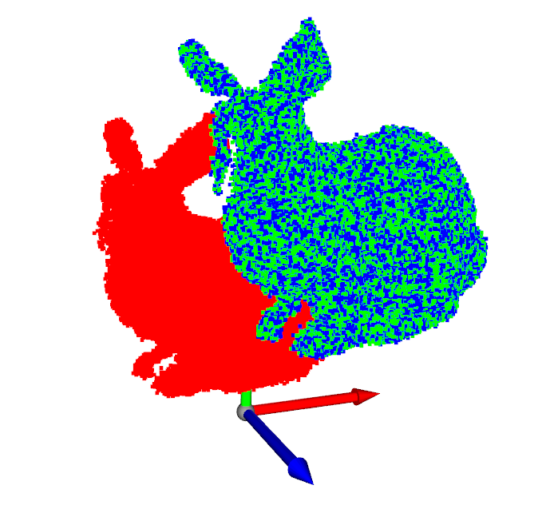

# Iterative Closest Point (ICP) Scan Matching 

## Overview :

Figure 1: Red bunny plot is the first point cloud. Green bunny plot is the target point cloud. Blue bunny plot is transformed first point cloud.

The code implements a Singular Value Decomposition (SVD) based ICP algorithm to solve pose change between a given set of point clouds in a stactic scene. 

## Contents :

The following files and folders are included:

- **Data** folder contains the Bunny point cloud files. You can use your own point clouds.
- **icp_scanmatch.py** python file contains code for the class 'IcpScanMatch' which performs Iterative Close Point scan matching on the provided 3D point clouds. The point clouds are rendered using Open3d python library.
- **utils.py** python file contains the code for function to calculate the error bewteen the trasnformed point cloud and the target point cloud.
- **main.ipynb** Jupyter Notebook is the script that loads the point clouds and runs the scan matching. The results are visualized in the Open3d render window.

## Dependencies :

* Please install the following dependencies prior to running the code:
    * `numpy` 
    * `open3d`
    * `sklearn`

## Usage :

Run the **main.ipynb** Jupyter Notebook file to run the Scan Match algorithm on the provided point clouds. 

The code should run without needing to make any changes to the source files. Point clouds other than the provided bunny point clouds can be used, although the necessary changes need to be made in the **main.ipynb** file. 

**Note:** The code is meant to run on two static point clouds.

